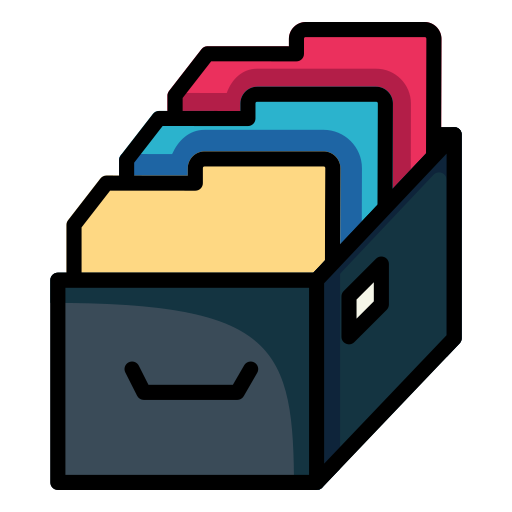

<div id="top"></div>

[![Contributors][contributors-shield]][contributors-url]
[![Forks][forks-shield]][forks-url]
[![Stargazers][stars-shield]][stars-url]
[![Issues][issues-shield]][issues-url]
[![MIT License][license-shield]][license-url]

<!-- [![LinkedIn][linkedin-shield]][linkedin-url] -->

<!-- PROJECT LOGO & INFO-->
<br />
<div align="center">
  <a href="https://github.com/wicket-warrick/PROXECTO2_NODE">
    
  </a>

  <h3 align="center">Collaborative Online News Web</h3>

  <p align="center">
    BOOTCAMP HACK A BOSS-2022
    <br />
    <br />
    <a href='https://github.com/wicket-warrick/PROXECTO2_NODE/tree/main/documentacion'><strong>Docs »</strong></a>
    <br />
    <a href="https://github.com/wicket-warrick/PROXECTO2_NODE/issues">Report issue</a>
   
  </p>
</div>

<!-- TABLE OF CONTENTS -->
<details>
  <summary>Table of Contents</summary>
  <ol>
    <li>
      <a href="#about-the-project">About The Project</a>
      <ul>
        <li><a href="#built-with">Built With</a></li>
      </ul>
    </li>
    <li>
      <a href="#getting-started">Getting Started</a>
      <ul>
        <li><a href="#installation">Installation</a></li>
      </ul>
    </li>
    <li><a href="#usage">Usage</a></li>
    <ul>
    <li><a href='#user-endpoints'>User Endpoints</a></li>
    <li><a href='#news-endpoints'>News Endpoints</a></li>
    </ul>
    <li><a href="#contributing">Contributing</a></li>
    <li><a href="#license">License</a></li>
    <li><a href="#contact">Contact</a></li>
    <li><a href="#acknowledgments">Acknowledgments</a></li>
  </ol>
</details>

<!-- ABOUT THE PROJECT -->

## About The Project

API-REST Project for Bootcamp Hack A Boss 2022(JAN-JUN).</br>
Collaborative news website.
</br>
</br>
Includes:

<ul>
<li> User management(register,login,edit...)</li><li>News management(create,edit,vote...)</li><li>Sample SQL database</li><li> POSTMAN request collection</li>
</ul>
<p align="right">(<a href="#top">back to top</a>)</p>

### Built With

- [Node.js](https://nodejs.dev/)
- [Express](https://expressjs.com/)
- [npm](https://npmjs.com/)

<p align="right">(<a href="#top">back to top</a>)</p>

<!-- GETTING STARTED -->

## Getting Started

In the next chapter you can read how to download and install the different components and utilities of this project.

### Installation

To get started, you must have a local copy on your computer.
There are two options:

A. CLONE the repo.

```sh
git clone https://github.com/wicket-warrick/PROXECTO2_NODE
```

B. DOWNLOAD the repo.
</br>
</br>
<a href='https://github.com/wicket-warrick/PROXECTO2_NODE/archive/refs/heads/main.zip'> Download repository</a>

### Config

1. Install NPM packages

   ```sh
   npm install
   ```

2. <p>Rename the '.example.env' file to '.env'; and configure the variables to be able to execute the project.If you currently do not have a SENGRID account, please visit the following <a href='https://sendgrid.com/'>link</a>.</p>

3. <p>Before creating the tables or loading the <a href='https://github.com/wicket-warrick/PROXECTO2_NODE/tree/main/documentacion/databaseExample'>sample database</a>, you must create a database/schema on your SQL server, with the variable name assigned in the .env document (MYSQL_DATABASE)</p>

4. <p>Once you have created the database/schema; has two configuration options:</p>
      <ul>
    </br>
    <li>Create the tables in the database/schema, without sample data.
    <b>NOTICE:</b> Image files are not contained in the repository</li>
    </br>

   ```sh
   node ./db/initDb.js
   ```

     <li>Import the <a href='https://github.com/wicket-warrick/PROXECTO2_NODE/tree/main/documentacion/databaseExample'>sample database</a> directly into your SQL server.
   </li>
    
    </ul>

5. <p>Import the <a href=https://github.com/wicket-warrick/PROXECTO2_NODE/blob/main/documentacion/NODE_PROJECT.postman_collection.json>POSTMAN collection</a>, in order to test the API functionalities.</p>

<p align="right">(<a href="#top">back to top</a>)</p>

<!-- USAGE EXAMPLES -->

## Usage

### Entities

### User Endpoints

- **POST /user** User registration.
- **GET /user/:idUser** Public information about user.
- **POST /user/login** Login User.
- **GET /user/validate/:registrationCode** Validate account.
- **POST /user/:idUser/avatar** Upload user avatar.
- **PUT /user/:idUser/password** Change user accoutn password.
- **PUT /user/:idUser** Edit user.
- **DELETE /user/:idUser** Delete user.
- **DELETE /user/:idUser/avatar/:idAvatar** Delete user avatar.
- **POST /user/recoverypassword** Get code to recovery/reset password.
- **POST /user/resetpassword** Reset password.

### News Endpoints

- **POST /new** Create new.
- **PUT /new/:idNew** Edit new.
- **DELETE /new/:idNew** Delete new.
- **GET /news/votes** Get news by votes.
- **GET /new/:idNew** Get new by idNew.
- **GET /news** Get news by topic and modfiedAt.
- **POST /new/:idNew/photo** Upload new's images.
- **DELETE /new/:idNew/photo/:idPhoto** Delete new's image.
- **GET /new/:idNew/photo** Get list new's images.
- **POST /new/:idNew/photo** Vote new

<p align="right">(<a href="#top">back to top</a>)</p>

<!-- CONTACT -->

## Contact

Hugo Suárez - [@your_twitter](https://twitter.com/your_username) - email@example.com
</br>
Juán Fernández - [@your_twitter](https://twitter.com/your_username) - email@example.com

<p align="right">(<a href="#top">back to top</a>)</p>

<!-- ACKNOWLEDGMENTS -->

## Acknowledgments

- [HACK A BOSS](https://www.hackaboss.com/)

<p align="right">(<a href="#top">back to top</a>)</p>

<!-- MARKDOWN LINKS & IMAGES -->
<!-- https://www.markdownguide.org/basic-syntax/#reference-style-links -->

[contributors-shield]: https://img.shields.io/github/contributors/othneildrew/Best-README-Template.svg?style=for-the-badge
[contributors-url]: https://github.com/othneildrew/Best-README-Template/graphs/contributors
[forks-shield]: https://img.shields.io/github/forks/othneildrew/Best-README-Template.svg?style=for-the-badge
[forks-url]: https://github.com/othneildrew/Best-README-Template/network/members
[stars-shield]: https://img.shields.io/github/stars/othneildrew/Best-README-Template.svg?style=for-the-badge
[stars-url]: https://github.com/othneildrew/Best-README-Template/stargazers
[issues-shield]: https://img.shields.io/github/issues/othneildrew/Best-README-Template.svg?style=for-the-badge
[issues-url]: https://github.com/othneildrew/Best-README-Template/issues
[license-shield]: https://img.shields.io/github/license/othneildrew/Best-README-Template.svg?style=for-the-badge
[license-url]: https://github.com/othneildrew/Best-README-Template/blob/master/LICENSE.txt
[linkedin-shield]: https://img.shields.io/badge/-LinkedIn-black.svg?style=for-the-badge&logo=linkedin&colorB=555
[linkedin-url]: https://linkedin.com/in/othneildrew
[product-screenshot]: images/screenshot.png
